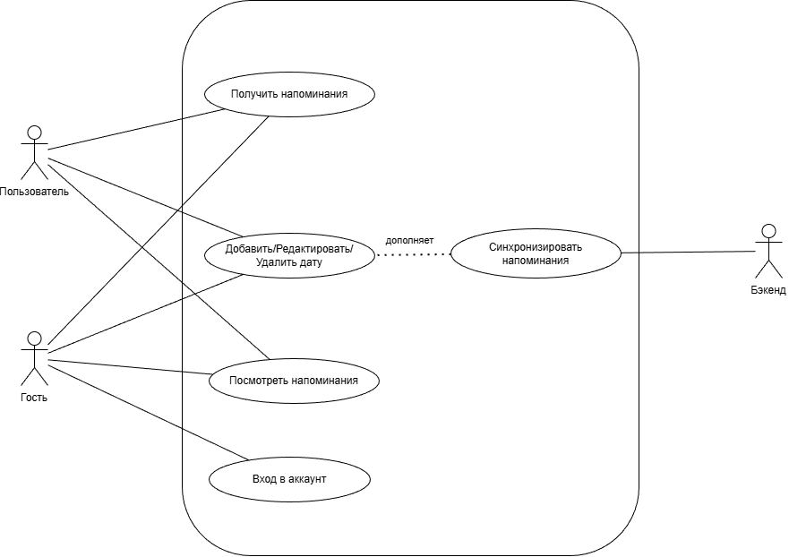
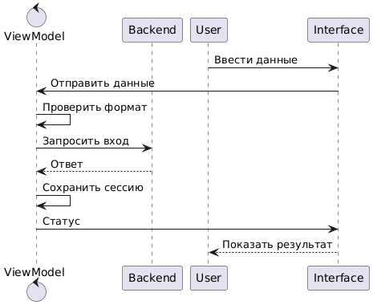
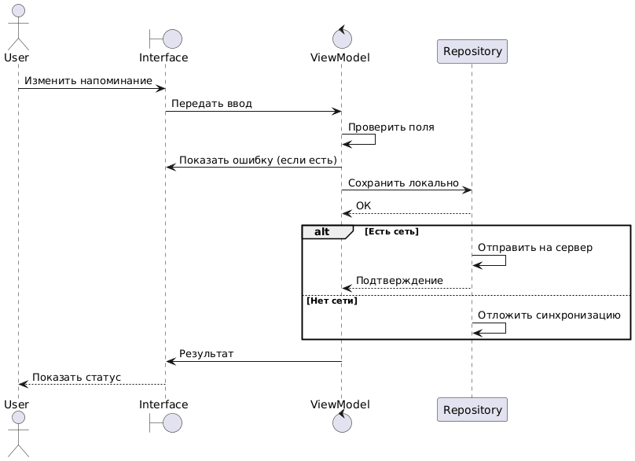
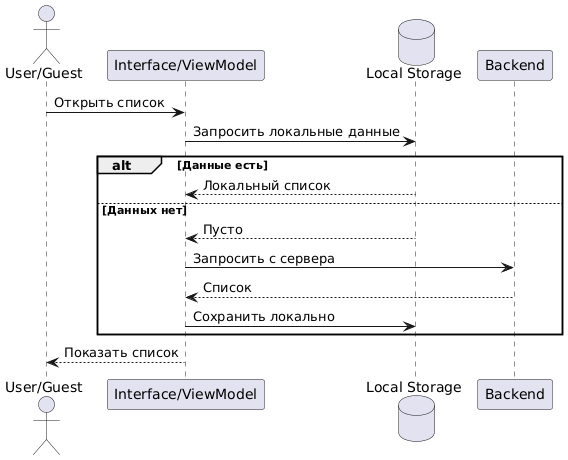
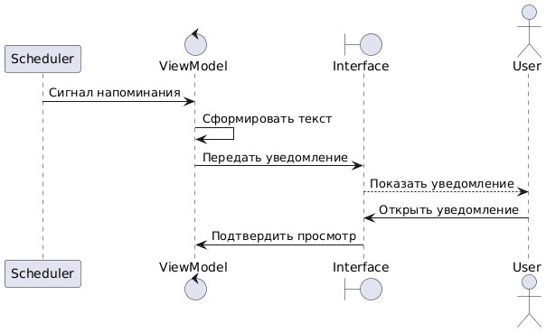

# DailyNotifications

## Материалы
- [Презентация](media/presentation.pptx)
- [Видео](media/reminders.mp4)

DailyNotifications — Android-приложение для создания напоминаний и получения локальных уведомлений.

## Возможности
- Создание, редактирование и удаление напоминаний.
- Частота: разово, ежедневно, еженедельно, пользовательская.
- Список с группировкой по датам и разделением на будущие/прошедшие.
- Локальные уведомления через WorkManager.
- Профиль: вход/регистрация или гостевой режим.
- Настройки: включение уведомлений и выбор формата времени (12/24).

## Диаграммы и экраны






## Технологии
- Kotlin, Jetpack Compose (Material 3)
- Navigation Compose
- WorkManager
- Room (SQLite)
- Hilt (DI)

## Требования
- Android Studio
- JDK 11
- minSdk 24, targetSdk 36

## Запуск
1. Откройте проект в Android Studio.
2. Дождитесь синхронизации Gradle.
3. Запустите конфигурацию `app` на эмуляторе или устройстве.

## Сборка из командной строки
```powershell
.\gradlew assembleDebug
```

## Разрешения
- `POST_NOTIFICATIONS` требуется на Android 13+.

## Примечания
- Авторизация реализована локально через SharedPreferences (без реального бекенда).
- Отправка напоминаний на сервер замокана.
- Настройки хранятся в памяти и сбрасываются после перезапуска приложения.
